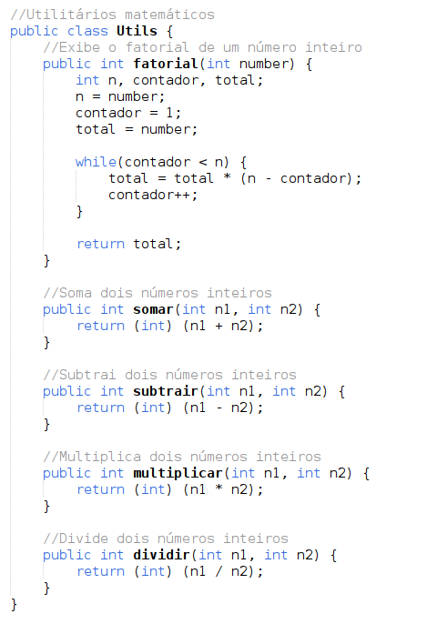

<!--Criativo-->

  

 

<!--Introdução-->

    

 
 

<table><tr>

</td valign="top" width="25%">
  
  

  <em>O conceito de encapsulamento é um dos quatro pilares da Programação Orientada á Objetos (POO) e consiste em proteger os dados internos de um objeto e expor apenas o nescessário para que outros objetos possam interagir com ele, é a           tecnica de agrupar dados e comportamentos relacionados em uma única cápsula (como uma classe), escondendo os detalhes internos e expondo apenas o nescessário para que o resto do programa interaja de forma segura e controlada.      </em>
  
  

</td>

</tr></table>

 

<!--Exemplo de encapsulamento-->
# Exemplo de encapsulamento - (linguagem Java)

<table>
<tr>
<td>
  <!--Imagem de exemplo (Classe de utilitários matemáticos)-->
  

    <h3>Utilitários matemáticos encapsulados</h3>
    
  

</td>
<td>
  

    
Com as operações matemáticas encapsuladas em uma única  classe, fica mais fácil manter, organizar e evoluir o código,  centralizando a lógica em um único ponto e evitando duplica ção.
    Para utilizar as operações matemáticas, apenas faça a  <strong><code>importação e instanciação</code></strong> do objeto. Depois, é só utilizar  os métodos da maneira que desejar.

     
  

  
<strong>1. Faz a soma de dois números inteiros</strong>

    UTILS.somar(10, 30);
<em>Retorno: 40</em>

  
<strong>2. Faz a subtração de dois números inteiros</strong>

    UTILS.subtrair(20, 5);
<em>Retorno: 15</em>

  
<strong>3. Faz a multiplicação de dois números inteiros</strong>

    UTILS.multiplicar(15, 2);
<em>Retorno: 30</em>

  
<strong>4. Faz a divisão de dois números inteiros</strong>

    UTILS.dividir(20, 5);
<em>Retorno: 4</em>

  </td>
  </tr>
</table>

<!--Art em construção-->

  

